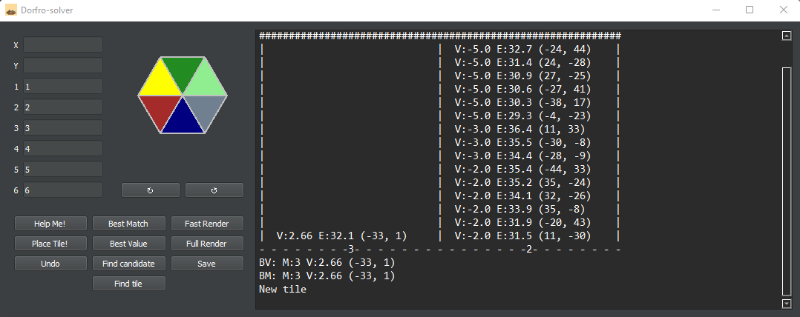

# Dorfro Solver

Dorfromantik tool to optimize tile placement

Fast render of the board created (3500 tiles)

## How it works

Python 3.10.X: https://www.python.org/downloads/

Install the required libraries: `pip install -r requirements.txt`

Launch with: `py dofro-solver.py`

A window allow you to input the tile you desire

In this example, the "Help Me!" button was pressed and the best placements are displayed on the right.

## Features:
- Help Me!: Gives you all the details you want to figure out the best placement
- Place Tile: X and Y must be fulfilled. Coordinates of each tile are displayed in the board.png file
- Best Match (BM): places automatically the tile with the most matches
- Best Value (BV): the most matches is not always the best option!
- Find Candidate: looking for a tile on the board that would fit the same
- Find Tile: looking for an exact tile on the board
- Fast Render: render only the tiles next to an empty slot
- Full Render: render all tiles (takes longer)
- Save: Remember to save before exiting!